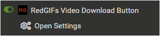

# NSFW Userscripts Collection

This collection contains userscripts designed for adult websites.

> *Note: This repository contains code only. No explicit media is included.*

[← Back to Main README](./README.md)

## Disclaimer

* **Age Restriction**: These scripts are intended only for users of legal age.
* **Usage**: Please use these scripts in a private environment.
* **Responsibility**: The author assumes no responsibility for any consequences resulting from the use of these scripts.

---

## Recent Updates

### 2026-01-05
- Updated `RedGIFs Video Download Button` (v2.1.0 -> v2.2.0)  

### 2025-12-21
- Updated `RedGIFs Video Download Button` (v2.0.0 -> v2.1.0)  

---

## Scripts

### 1. RedGIFs Video Download Button

This script enhances your RedGIFs experience by adding convenient buttons to each video:
1.  **A download button** for one-click downloads of the HD version.
2.  **An "Open in New Tab" button** to quickly view the video on its own page.

It also features **customizable user settings** (e.g., Hover Mode) and a powerful **Annoyance & Ad Remover** to clean up the UI.

> **Note**  
> This script is published on both **Greasy Fork** and **Sleazy Fork**.
> 
> - **Greasy Fork**: Well-known userscript platform, but NSFW scripts require login to view.  
> - **Sleazy Fork**: A sister site of Greasy Fork dedicated to adult content, accessible without login.
> 
> If you cannot view the script page on Greasy Fork, please use the Sleazy Fork link instead.

| Platform | GitHub | Greasy Fork | Sleazy Fork | Version | Last Updated | Changelog |
| :--- | :--- | :--- | :--- | :--- | :--- | :--- |
| **RedGifs** |  |  |  | 2.2.0 | 2026-01-05 | [View](./docs/RedGIFs-Video-Download-Button/CHANGELOG.md) |

  
Getting Started (Click to expand)

> Access the settings via your userscript manager's menu:
> 
> 1.  Open the **Tampermonkey** (or equivalent) menu in your browser.
> 2.  Select **RedGIFs Video Download Button Settings**.
> 3.  Configure your preferences in the modal window.
> 
>   
> 

  
A Note on Annoyance & Ad Remover feature (Click to expand)

> Please consider the Annoyance & Ad Removal a "best-effort" bonus feature. The script's core purpose remains the `Download` and `Open in New Tab` buttons.
> 
> This feature is tuned for the current RedGIFs site layout (as of 2025/12/03), and future site updates will likely break parts of the removal logic. While I will try to keep it functional, please understand that ongoing maintenance for this specific feature is not guaranteed, as it is secondary to the script's main functionality.

  
Potential Conflict Warning (Click to expand)

> This script modifies the global `JSON.parse` function and **may conflict with other userscripts that modify the same function**.  
> If you experience page errors or downloads failing, please **temporarily disable all other userscripts active on RedGIFs** to determine if the cause is **a script conflict** or **a recent site update**.

