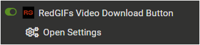
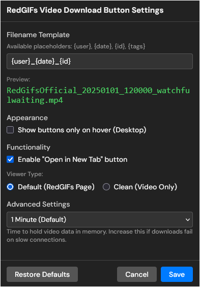

# NSFW Userscripts Collection

This collection contains userscripts designed for adult websites.

> *Note: This repository contains code only. No explicit media is included.*

[← Back to Main README](./README.md)

## Disclaimer

* **Age Restriction**: These scripts are intended only for users of legal age.
* **Usage**: Please use these scripts in a private environment.
* **Responsibility**: The author assumes no responsibility for any consequences resulting from the use of these scripts.

---

## Recent Updates

### 2026-07-11
- Updated `RedGIFs Video Download Button` (v2.5.1 -> v2.6.0)  

### 2026-06-04
- Updated `RedGIFs Video Download Button` (v2.5.0 -> v2.5.1)  

### 2026-06-02
- Updated `RedGIFs Video Download Button` (v2.4.0 -> v2.5.0)  

---

## Scripts

### 1. RedGIFs Video Download Button

This script enhances your RedGIFs experience by adding convenient buttons to each video and photo:
1. **A download button** for one-click downloads of the HD video or maximum-resolution photo.
2. **An "Open in New Tab" button** to quickly view the media on its own page (or in the distraction-free **Clean Viewer**).

It also features **customizable user settings** (e.g., Hover Mode) and a powerful **Annoyance & Ad Remover** to clean up the UI.

> **Note**  
> This script is published on both **Greasy Fork** and **Sleazy Fork**.
> 
> - **Greasy Fork**: Well-known userscript platform, but NSFW scripts require login to view.  
> - **Sleazy Fork**: A sister site of Greasy Fork dedicated to adult content, accessible without login.
> 
> If you cannot view the script page on Greasy Fork, please use the Sleazy Fork link instead.

| Platform | GitHub | Greasy Fork | Sleazy Fork | Version | Last Updated | Changelog |
| :--- | :--- | :--- | :--- | :--- | :--- | :--- |
| **RedGifs** |  |  |  | 2.6.0 | 2026-07-11 | [View](./docs/RedGIFs-Video-Download-Button/CHANGELOG.md) |

##### Configuration (Settings Menu)

Access the settings via your userscript manager's menu:

1.  Open the **Tampermonkey** (or equivalent) menu in your browser.
2.  Select **RedGIFs Video Download Button Settings**.
3.  Configure your preferences in the modal window.

  

  

<strong>Available Options</strong> <i>(Click to Expand)</i>

<ol>
  <li>
    <strong>Filename Template</strong>
    <ul>
      <li>Customize the naming format for downloaded files.</li>
      <li><strong>Placeholders:</strong> <code>{user}</code>, <code>{date}</code>, <code>{id}</code>, <code>{tags}</code></li>
      <li><i>Includes a real-time preview to ensure your format is correct.</i></li>
    </ul>
      </li>
  <li>
    <strong>Appearance: Show buttons only on hover</strong>
    <ul>
      <li>If enabled, buttons are hidden by default and only appear when you hover your mouse over a video or thumbnail.</li>
      <li><i>Note: On mobile devices, buttons remain always visible to ensure usability.</i></li>
    </ul>
      </li>
  <li>
    <strong>Functionality: Open in New Tab</strong>
    <ul>
      <li><strong>Enable Button:</strong> Toggle this OFF if you prefer a cleaner look with only the Download button.</li>
      <li><strong>Viewer Type:</strong>
        <ul>
          <li><strong>Default:</strong> Opens the standard RedGIFs watch page.</li>
          <li><strong>Clean:</strong> Opens the media in a minimal, player-only or image-only window.</li>
        </ul>
      </li>
    </ul>
      </li>
  <li>
    <strong>Advanced Settings</strong>
    <ul>
      <li><strong>Blob Revoke Time:</strong> Adjust the time media data is held in memory. Increase this if your downloads are failing (e.g., saving as 0-byte files) on a slow internet connection.</li>
    </ul>
  </li>
</ol>

  
A Note on Annoyance & Ad Remover feature (Click to expand)

> Please consider the Annoyance & Ad Removal a "best-effort" bonus feature. The script's core purpose remains the `Download` and `Open in New Tab` buttons.
> 
> This feature is tuned for the current RedGIFs site layout, and future site updates will likely break parts of the removal logic. While I will try to keep it functional, please understand that ongoing maintenance for this specific feature is not guaranteed, as it is secondary to the script's main functionality.

