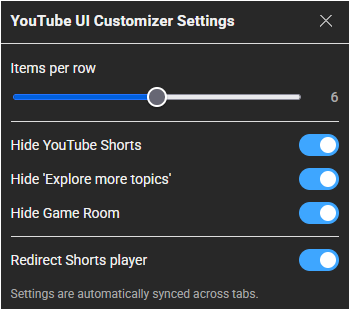
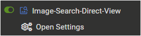
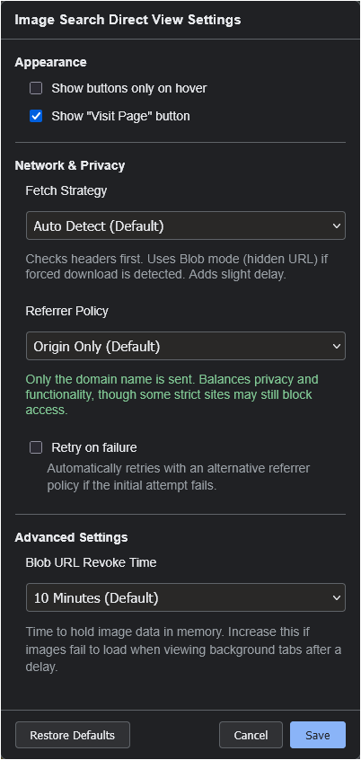

# Userscripts-Collection

A collection of simple, single-purpose userscripts for various websites.

> 🔞 **Looking for RedGIFs scripts?**  
> Scripts for adult platforms have been moved to the **[NSFW Userscripts Collection](./NSFW.md)**.

---

## Recent Updates

### 2026/01/04
- Published a new script `Image Search Direct View` (v1.0.0)  
- Separated NSFW scripts to [`NSFW.md`](./NSFW.md)

### 2025/12/07
- Updated `YouTube UI Customizer` (v1.2.1 -> v1.3.0)  

---

## Scripts in This Project

This section lists the userscripts available in this collection.

### 1. YouTube UI Customizer

A script that enhances your YouTube experience. You can customize the video grid layout by adjusting thumbnails per row, completely hide Shorts content, and automatically redirect the Shorts player to the standard video player.

> Note: This script is designed specifically for the **desktop** YouTube site (www.youtube.com) and does not support the mobile version (m.youtube.com).

| Platform | GitHub | Greasy Fork | Version | Last Updated | Changelog |
| :--- | :--- | :--- | :--- | :--- | :--- |
| **YouTube** |  |  | 1.3.0 | 2025/12/07 | [View](./docs/YouTube-UI-Customizer/CHANGELOG.md) |

  
Getting Started (Click to expand)

> Access the settings via your userscript manager's menu:
> 
> 1.  Open the **Tampermonkey** (or equivalent) menu in your browser.
> 2.  Select **YouTube UI Customizer Settings**.
> 3.  Configure your preferences in the modal window.
> 
>   
> 

---

### 2. Image Search Direct View

A script that adds a "View Image" button and a "Visit Page" button to image search results for multiple sites.

It allows you to view the high-resolution image directly in a new tab. It also includes a robust **Fetch Strategy** and **Referrer Policy** control to handle sites with anti-hotlinking protections, ensuring images load correctly where other scripts might fail.

> This script uses image URLs and metadata exposed by the search engine's search results.
> It does not scrape external websites, **so the original raw file is not guaranteed**.
> 
> **Search engine implementations change frequently**.
> Breakages caused by such changes are expected behavior, not logic bugs.
> Since I am not a psychic, I cannot predict future changes.
> 
> **Please do not treat such breakages as simple bugs or demand immediate fixes,
as this kind of expectation discourages further maintenance.**
> 
> **If you are not comfortable with these limitations, please do not use this script.**

| Platform | GitHub | Greasy Fork | Version | Last Updated | Changelog |
| :--- | :--- | :--- | :--- | :--- | :--- |
| **Bing** **DuckDuckGo** **Google** |  |  | 1.0.0 | 2026/01/04 | [View](./docs/Image-Search-Direct-View/CHANGELOG.md) |

  
Getting Started (Click to expand)

> Access the settings via your userscript manager's menu:
> 
> 1.  Open the **Tampermonkey** (or equivalent) menu in your browser.
> 2.  Select **Open Settings** (registered by the script).
> 3.  Configure your preferences (e.g., Show buttons only on hover, Fetch Strategy, Referrer Policy).
> 
>   
> 

**[View Detailed Features & Manual](./docs/Image-Search-Direct-View/README.md)**

---

## Installation

1.  Please install [Tampermonkey](https://www.tampermonkey.net/) or any userscript management tool in your browser.
2.  Click the "Download" or "Install" link for the script you wish to use.

---

## Updating

Open the script to be updated in the Tampermonkey dashboard and **replace the entire content** with the latest version, then save. (The Greasy Fork version updates automatically).

---

## Tested Environment

- These scripts are primarily developed and tested on **Firefox** with **Tampermonkey**.
- It is also confirmed to work on Chromium-based browsers, but testing on these platforms is less extensive.
- They are developed for **desktop browsers**.
- They have **not** been tested on actual mobile devices, so functionality on mobile browsers is unknown.

---

## License

This project is licensed under the MIT License.

## Author

* [p65536](https://github.com/p65536)
